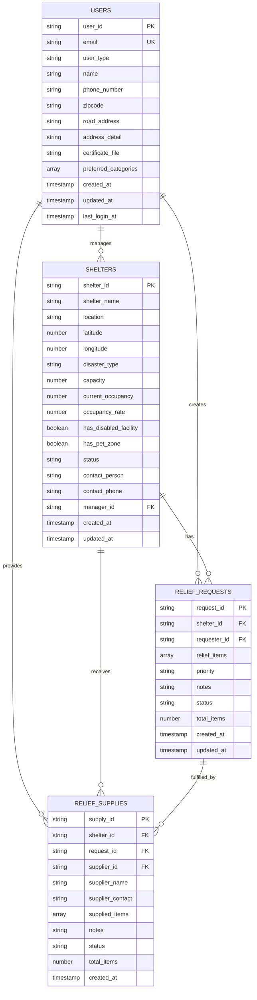
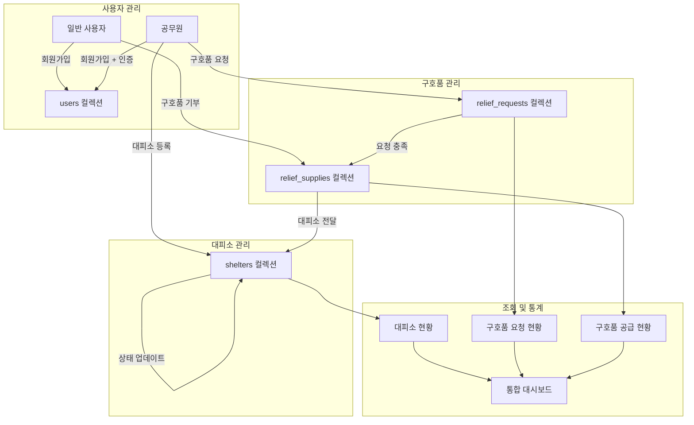

# Firebase Firestore 스키마 문서

## 📋 목차
1. [프로젝트 개요](#프로젝트-개요)
2. [Firestore 컬렉션 구조](#firestore-컬렉션-구조)
3. [컬렉션별 상세 스키마](#컬렉션별-상세-스키마)
4. [관계도](#관계도)
5. [API 서비스 매핑](#api-서비스-매핑)

---

## 프로젝트 개요

### Firebase 프로젝트 정보
- **프로젝트 ID**: `disastersafety-3e0ca`
- **호스팅 타겟**:
  - `admin`: 관리자 페이지
  - `user`: 일반 사용자 페이지

### 주요 컬렉션
1. **users** - 사용자 정보
2. **shelters** - 대피소 정보
3. **relief_requests** - 구호품 요청
4. **relief_supplies** - 구호품 공급 기록

---

## Firestore 컬렉션 구조

### 🗂️ 컬렉션 목록

| 컬렉션명 | 설명 | 문서 ID 형식 | 주요 용도 |
|---------|------|-------------|----------|
| users | 사용자 정보 | email (이메일 주소) | 사용자 인증 및 프로필 |
| shelters | 대피소 정보 | SH{timestamp} | 대피소 관리 |
| relief_requests | 구호품 요청 | REQ{timestamp} | 구호품 요청 관리 |
| relief_supplies | 구호품 공급 | SUP{timestamp} | 구호품 공급 추적 |

---

## 컬렉션별 상세 스키마

### 1. users 컬렉션

**문서 ID**: 사용자 이메일 주소

| 필드명 | 타입 | 설명 | 필수 | 예시 |
|-------|------|------|-----|-----|
| user_id | string | 사용자 UID | ✓ | "abc123..." |
| email | string | 이메일 주소 | ✓ | "user@example.com" |
| user_type | string | 사용자 유형 | ✓ | "general_user", "public_officer" |
| name | string | 사용자 이름 | ✓ | "홍길동" |
| phone_number | string \| null | 전화번호 | | "010-1234-5678" |
| zipcode | string \| null | 우편번호 | | "12345" |
| road_address | string \| null | 도로명 주소 | | "서울시 강남구..." |
| address_detail | string \| null | 상세 주소 | | "101호" |
| certificate_file | string \| null | 인증서 파일 (공무원용) | | "cert_url..." |
| preferred_categories | array \| null | 선호 카테고리 | | ["FOOD", "MEDICAL"] |
| created_at | string | 생성 시간 (ISO 8601) | ✓ | "2024-01-01T12:00:00Z" |
| updated_at | string | 수정 시간 (ISO 8601) | ✓ | "2024-01-01T12:00:00Z" |
| last_login_at | string \| null | 마지막 로그인 | | "2024-01-01T12:00:00Z" |

**사용자 유형 (user_type)**:
- `general_user`: 일반 사용자
- `public_officer`: 공무원

---

### 2. shelters 컬렉션

**문서 ID**: SH{timestamp} (예: SH1704067200000)

| 필드명 | 타입 | 설명 | 필수 | 예시 |
|-------|------|------|-----|-----|
| shelter_id | string | 대피소 ID | ✓ | "SH1704067200000" |
| shelter_name | string | 대피소명 | ✓ | "강남구민체육센터" |
| location | string | 주소 | ✓ | "서울시 강남구..." |
| latitude | number \| null | 위도 | | 37.123456 |
| longitude | number \| null | 경도 | | 127.123456 |
| disaster_type | string | 재난 유형 | ✓ | "지진", "홍수", "화재" |
| capacity | number | 수용 가능 인원 | ✓ | 500 |
| current_occupancy | number | 현재 수용 인원 | ✓ | 150 |
| occupancy_rate | number | 수용률 (%) | ✓ | 30 |
| has_disabled_facility | boolean | 장애인 편의시설 | ✓ | true |
| has_pet_zone | boolean | 반려동물 수용 | ✓ | false |
| status | string | 운영 상태 | ✓ | "운영중", "포화", "폐쇄" |
| contact_person | string | 담당자명 | ✓ | "김담당" |
| contact_phone | string | 담당자 연락처 | ✓ | "010-1234-5678" |
| manager_id | string \| null | 관리자 ID | | "manager123" |
| created_at | string | 생성 시간 | ✓ | "2024-01-01T12:00:00Z" |
| updated_at | string | 수정 시간 | ✓ | "2024-01-01T12:00:00Z" |

**재난 유형 (disaster_type)**:
- `지진`
- `화재`
- `홍수`
- `태풍`
- `산사태`
- `기타`

**운영 상태 (status)**:
- `운영중`: 정상 운영
- `포화`: 수용 인원 포화
- `폐쇄`: 운영 중단

---

### 3. relief_requests 컬렉션

**문서 ID**: REQ{timestamp} (예: REQ1704067200000)

| 필드명 | 타입 | 설명 | 필수 | 예시 |
|-------|------|------|-----|-----|
| request_id | string | 요청 ID | ✓ | "REQ1704067200000" |
| shelter_id | string | 대피소 ID | ✓ | "SH1704067200000" |
| requester_id | string | 요청자 ID | ✓ | "officer123" |
| relief_items | array | 구호품 목록 | ✓ | 아래 참조 |
| priority | string | 우선순위 | | "urgent", "high", "normal", "low" |
| notes | string | 추가 메모 | | "긴급 필요" |
| status | string | 상태 | ✓ | "pending", "in_progress", "completed", "cancelled" |
| total_items | number | 총 아이템 수 | ✓ | 5 |
| created_at | string | 생성 시간 | ✓ | "2024-01-01T12:00:00Z" |
| updated_at | string | 수정 시간 | ✓ | "2024-01-01T12:00:00Z" |

**relief_items 배열 구조**:
```json
{
  "category": "식량",
  "subcategory": "즉석식품",
  "item": "컵라면",
  "quantity": 100,
  "unit": "개"
}
```

---

### 4. relief_supplies 컬렉션

**문서 ID**: SUP{timestamp} (예: SUP1704067200000)

| 필드명 | 타입 | 설명 | 필수 | 예시 |
|-------|------|------|-----|-----|
| supply_id | string | 공급 ID | ✓ | "SUP1704067200000" |
| shelter_id | string | 대피소 ID | ✓ | "SH1704067200000" |
| request_id | string \| null | 관련 요청 ID | | "REQ1704067200000" |
| supplier_id | string | 공급자 ID | ✓ | "supplier123" |
| supplier_name | string | 공급자명 | ✓ | "한국적십자사" |
| supplier_contact | string | 공급자 연락처 | ✓ | "02-1234-5678" |
| supplied_items | array | 공급 물품 목록 | ✓ | relief_items와 동일 구조 |
| notes | string | 메모 | | "배송 완료" |
| status | string | 상태 | ✓ | "delivered", "pending", "cancelled" |
| total_items | number | 총 아이템 수 | ✓ | 5 |
| created_at | string | 생성 시간 | ✓ | "2024-01-01T12:00:00Z" |

---

## 관계도

### ERD (Entity Relationship Diagram)



### 데이터 플로우 다이어그램



---

## API 서비스 매핑

### 서비스 파일 구조

```
services/
├── user/
│   ├── authService.js       # 인증 관련
│   ├── userService.js       # 사용자 CRUD
│   └── reliefService.js     # 구호품 조회
├── admin/
│   ├── authService.js       # 관리자 인증
│   ├── userService.js       # 사용자 관리
│   ├── shelterService.js    # 대피소 CRUD
│   └── reliefService.js     # 구호품 관리
```

### 주요 API 함수

#### 1. 사용자 서비스 (userService.js)

| 함수명 | 설명 | 컬렉션 | 작업 |
|-------|------|--------|-----|
| createUser | 사용자 생성 | users | CREATE |
| getUser | 사용자 조회 (email) | users | READ |
| updateUser | 사용자 정보 수정 | users | UPDATE |
| deleteUser | 사용자 삭제 | users | DELETE |
| getUsersByType | 유형별 사용자 조회 | users | QUERY |
| checkUserExists | 사용자 존재 확인 | users | EXISTS |

#### 2. 대피소 서비스 (shelterService.js)

| 함수명 | 설명 | 컬렉션 | 작업 |
|-------|------|--------|-----|
| createShelter | 대피소 등록 | shelters | CREATE |
| getShelter | 대피소 조회 | shelters | READ |
| getAllShelters | 전체 대피소 조회 | shelters | LIST |
| getSheltersByManager | 관리자별 대피소 | shelters | QUERY |
| updateShelter | 대피소 정보 수정 | shelters | UPDATE |
| deleteShelter | 대피소 삭제 | shelters | DELETE |
| getSheltersByDisasterType | 재난별 대피소 | shelters | QUERY |

#### 3. 구호품 서비스 (reliefService.js)

| 함수명 | 설명 | 컬렉션 | 작업 |
|-------|------|--------|-----|
| createReliefRequest | 구호품 요청 등록 | relief_requests | CREATE |
| getReliefRequestsByShelter | 대피소별 요청 | relief_requests | QUERY |
| getAllReliefRequests | 전체 요청 조회 | relief_requests | LIST |
| updateReliefRequestStatus | 요청 상태 수정 | relief_requests | UPDATE |
| addReliefSupply | 구호품 공급 등록 | relief_supplies | CREATE |
| getReliefSuppliesByShelter | 대피소별 공급 | relief_supplies | QUERY |
| getReliefStatistics | 구호품 통계 | relief_requests, relief_supplies | AGGREGATE |
| getReliefCategoryStatistics | 카테고리별 통계 | relief_requests, relief_supplies | AGGREGATE |

---

## 구호품 카테고리 구조

### 메인 카테고리

1. **식량 (FOOD)**
   - 즉석식품
   - 통조림
   - 음료
   - 간식류

2. **생활용품 (LIVING)**
   - 위생용품
   - 여성용품
   - 세탁/청소
   - 일상용품

3. **의약품 (MEDICAL)**
   - 일반의약품
   - 구급용품
   - 마스크류
   - 건강보조식품

4. **의류 (CLOTHING)**
   - 방한용품
   - 의류
   - 속옷
   - 신발류

5. **유아·아동용품 (CHILD)**
   - 유아식
   - 위생용품
   - 놀이용품
   - 아동복

6. **기타 (OTHER)**
   - 직접입력

---

## 인덱스 요구사항

Firestore 복합 인덱스가 필요한 쿼리:

1. **shelters 컬렉션**
   - `manager_id` + `created_at` (DESC)
   - `disaster_type` + `created_at` (DESC)

2. **relief_requests 컬렉션**
   - `shelter_id` + `created_at` (DESC)
   - `status` + `created_at` (DESC)

3. **relief_supplies 컬렉션**
   - `shelter_id` + `created_at` (DESC)
   - `request_id` + `created_at` (DESC)

---

## 보안 규칙 권장사항

### 기본 규칙 구조

```javascript
// users 컬렉션
match /users/{email} {
  allow read: if request.auth != null &&
    (request.auth.token.email == email ||
     request.auth.token.user_type == 'public_officer');
  allow write: if request.auth != null &&
    request.auth.token.email == email;
}

// shelters 컬렉션
match /shelters/{shelterId} {
  allow read: if true;  // 모든 사용자 조회 가능
  allow write: if request.auth != null &&
    request.auth.token.user_type == 'public_officer';
}

// relief_requests 컬렉션
match /relief_requests/{requestId} {
  allow read: if true;  // 모든 사용자 조회 가능
  allow create: if request.auth != null &&
    request.auth.token.user_type == 'public_officer';
  allow update: if request.auth != null;
}

// relief_supplies 컬렉션
match /relief_supplies/{supplyId} {
  allow read: if true;  // 모든 사용자 조회 가능
  allow write: if request.auth != null;
}
```

---

## 최적화 권장사항

1. **문서 ID 전략**
   - users: 이메일을 ID로 사용하여 직접 조회 최적화
   - 나머지: 타임스탬프 기반 ID로 시간순 정렬 지원

2. **쿼리 최적화**
   - 클라이언트 측 정렬 사용 (인덱스 문제 회피)
   - 필요한 필드만 선택적 조회
   - 페이지네이션 구현 권장

3. **캐싱 전략**
   - 자주 변경되지 않는 대피소 정보 캐싱
   - 사용자 정보 로컬 스토리지 활용

4. **배치 작업**
   - 다중 문서 업데이트 시 배치 쓰기 사용
   - 트랜잭션으로 데이터 일관성 보장

---

## 마이그레이션 가이드

### 스키마 변경 시 고려사항

1. **필드 추가**: 기본값 설정으로 하위 호환성 유지
2. **필드 삭제**: Deprecated 마킹 후 단계적 제거
3. **필드 타입 변경**: 새 필드 추가 → 데이터 마이그레이션 → 기존 필드 제거
4. **컬렉션 구조 변경**: 병렬 운영 → 점진적 마이그레이션

---

## 모니터링 및 로깅

### 추적 권장 메트릭

1. **사용자 활동**
   - 일일 활성 사용자 (DAU)
   - 사용자 유형별 분포
   - 로그인 빈도

2. **대피소 운영**
   - 수용률 변화 추이
   - 재난 유형별 대피소 활용도
   - 평균 체류 시간

3. **구호품 효율성**
   - 요청 대비 공급률
   - 카테고리별 수요 패턴
   - 평균 배송 소요 시간

---

## 버전 관리

- **현재 버전**: 1.0.0
- **최종 업데이트**: 2024-01-23
- **다음 업데이트 예정**:
  - 실시간 알림 시스템 추가
  - 자원봉사자 관리 컬렉션
  - 재난 이력 추적 시스템